# front-end_treehouse_course
## Front End Web Development course at Treehouse.
- - -
**1. Introduction to HTML and CSS**  :heavy_check_mark:
* Define HTML and CSS
* Add and change HTML tags
* Modify CSS attributes
* Learn the structural foundation of web pages and applications
- - -
**2. HTML Basics** :heavy_check_mark:
* Semantic markup
* Formatting page content
* Understanding file paths
* Displaying images
* Inline vs. block level elements
- - -
**3. CSS Basics** :heavy_check_mark:
* Basic Selectors
* Common Values and Units
* CSS Layout
* New CSS Features
- - -
**4. Debugging CSS with Chrome DevTools** :heavy_check_mark:
* Chrome Developer Tools basics
- - -
**5. JavaScript Basics** :heavy_check_mark:
* What JavaScript is and where it is used
* Basic programming concepts like variables, data types and conditional statements
* What functions are and why they're useful
* How to troubleshoot programming problems
* The basic syntax of the JavaScript programming language
- - -
**6. CSS Layout Basics** :heavy_check_mark:
* Getting Started with CSS Layout
* Controlling Layout with CSS Display Modes
* Page Layout with the Float Property
* CSS Layout Project
* Positioning Page Content
- - -
**7. Responsive Layouts** :heavy_check_mark:
* Responsive design theory
* Media queries
* Breakpoints
* Page layout
- - -
**8. CSS Flexbox Layout** :heavy_check_mark:
* Understanding Flexbox
* Flexbox Properties
* Building a Layout with Flexbox

> Screenshot of "Best City Giude" responsive webpage created with CSS Flexbox on large screen.

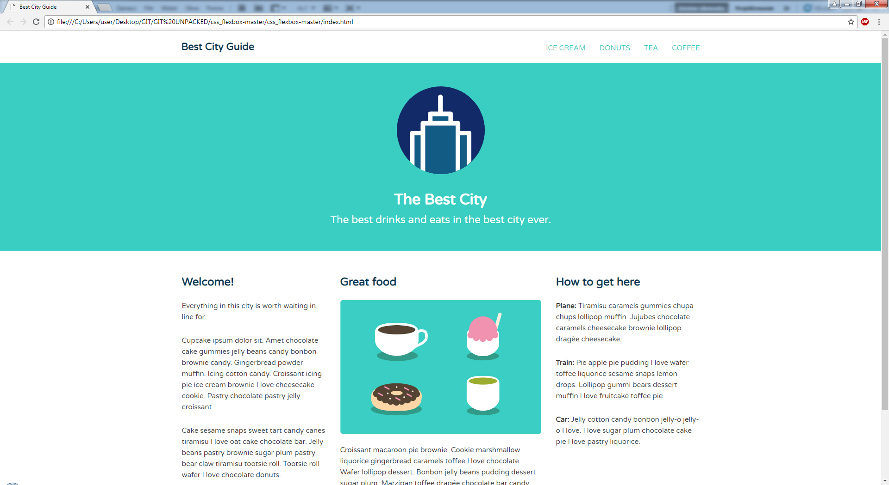
  

> Screenshot of "Best City Giude" responsive webpage created with CSS Flexbox on medium screen.

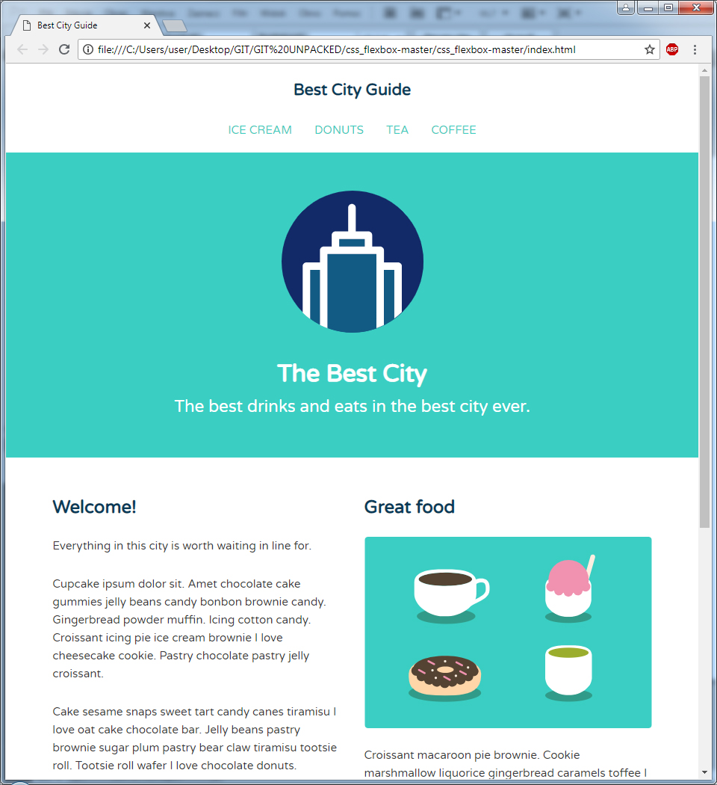   

> Screenshot of "Best City Giude" responsive webpage created with CSS Flexbox on smaller screen.

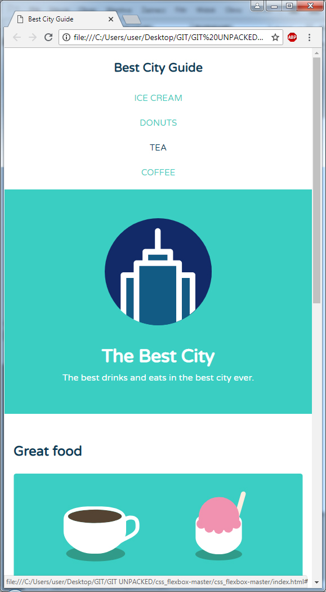   

  - - -
**9. HTML Forms** :heavy_check_mark:
* Forms
* Input elements
* Select menus
* Radio buttons
* Checkboxes

> Screenshot of "Sign up form" responsive webpage created with HTML forms.

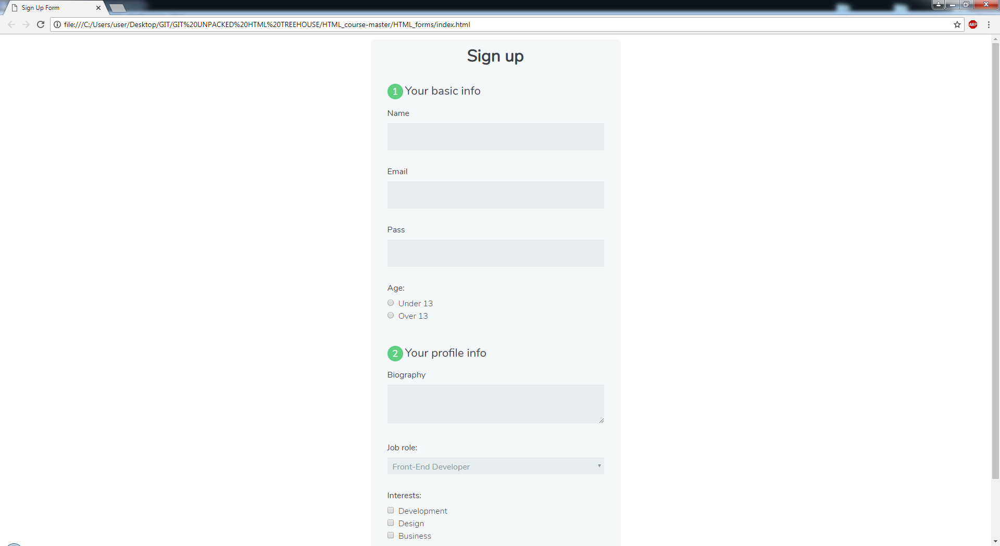  

- - -
**10. Introduction to Git** :heavy_check_mark:
* Git basics
* GitHub 
- - -
**11. JavaScript Loops, Arrays and Objects** :heavy_check_mark:
* Loops
* Arrays
* Objects
* DRY Programming

> Screenshot of "Color Blocks" webpage created with JS loops.

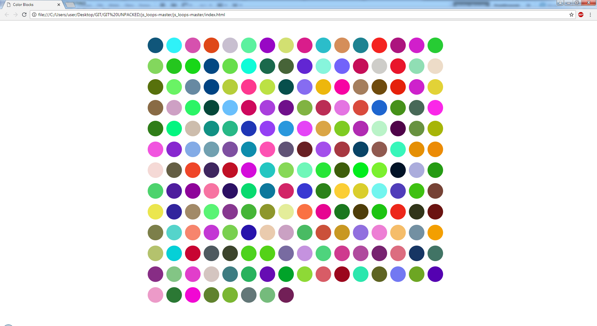  

- - -
**12. JavaScript and the DOM** :heavy_check_mark:
* What is the DOM?
* Making Changes to the DOM
* Responding to User Interaction
* Travelling Through the DOM (Traversal)
- - -
**13. CSS Selectors** :heavy_check_mark:
* Attribute selectors
* Advanced pseudo-classes
* Pseudo-elements

> Screenshot of "My Gallery"  webpage created with CSS Selectors.

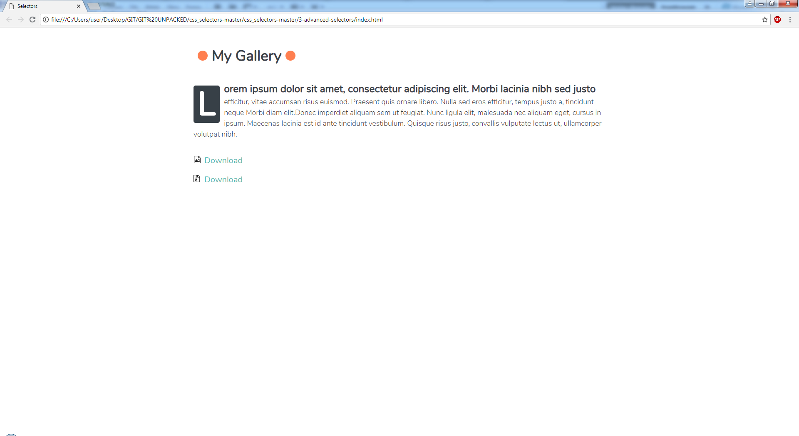  

> Screenshot of "Contact Form" webpage created with CSS Selectors.

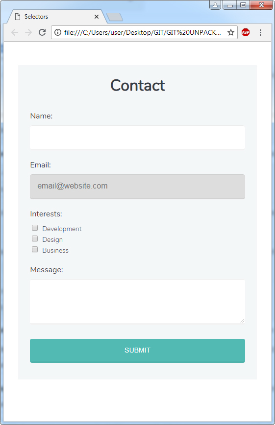  

> Screenshot of "Contact Form" with reset button, webpage created with CSS Selectors.

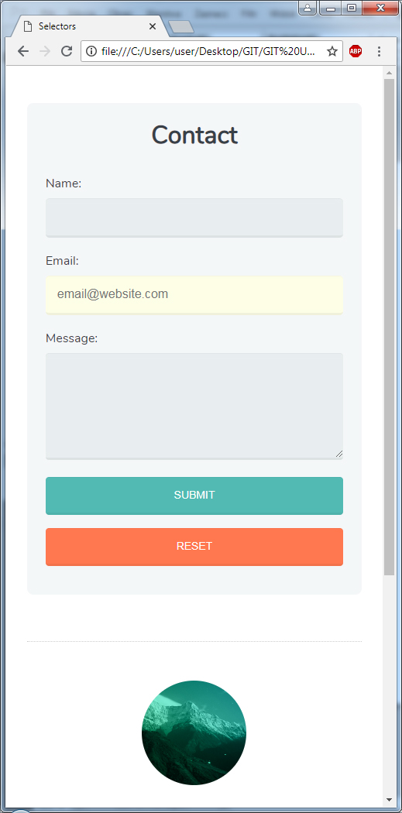  

- - -
**14. jQuery Basics** :heavy_check_mark:
* Event handling
* Manipulating the DOM
* DOM Traversal
* jQuery Collections

> Screenshot of "jQuery Weekly" webpage created with jQuery.

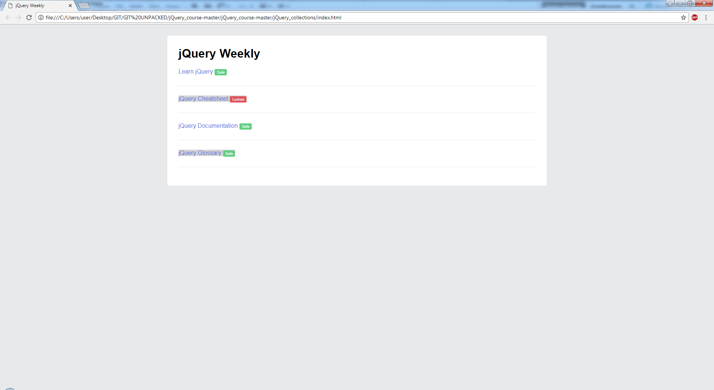  

> Screenshot of "Blog Post" webpage animation created with jQuery.

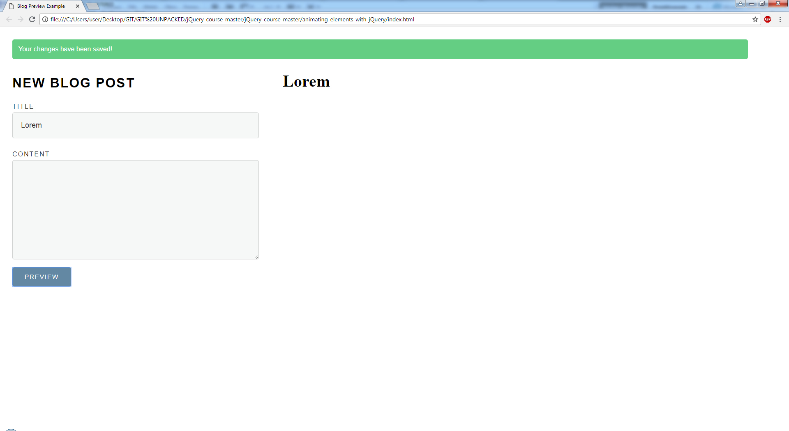  

- - -
**15. Bootstrap 4 Basics** :heavy_check_mark:
* Working with components
* Layout with the grid
* Styling content
* Building and laying out forms

> Screenshot of "Full Stack Conf" webpage created with bootstrap components.

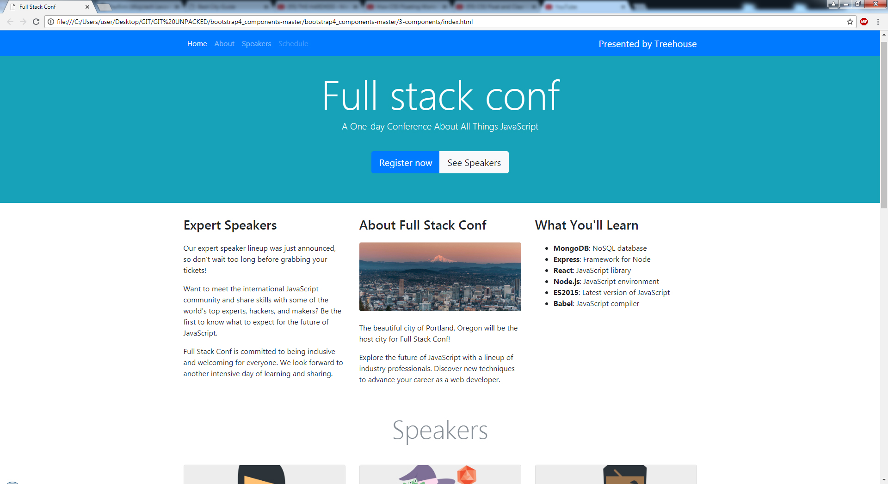  

- - -
**16. Introduction to Front End Performance Optimization** :heavy_check_mark:
* Performance measurement
* Reduce HTTP requests
* CSS and JavaScript minification
- - -
**17. HTML Tables** :heavy_check_mark:
* Table elements
* Organizing tables

> Screenshot of "Employee information" webpage created with HTML tables.

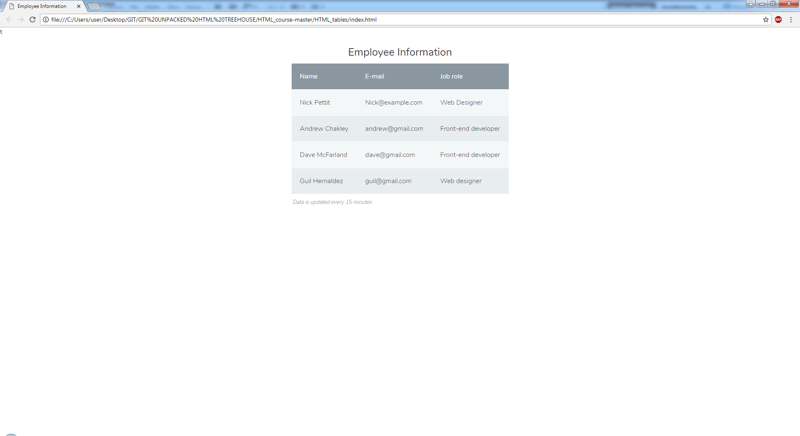  

- - -
**18. HTML Video and Audio** :heavy_check_mark:
* Video element
* Audio element
* Custom media players

> Screenshot of "HTML Video and Audio"  webpage.

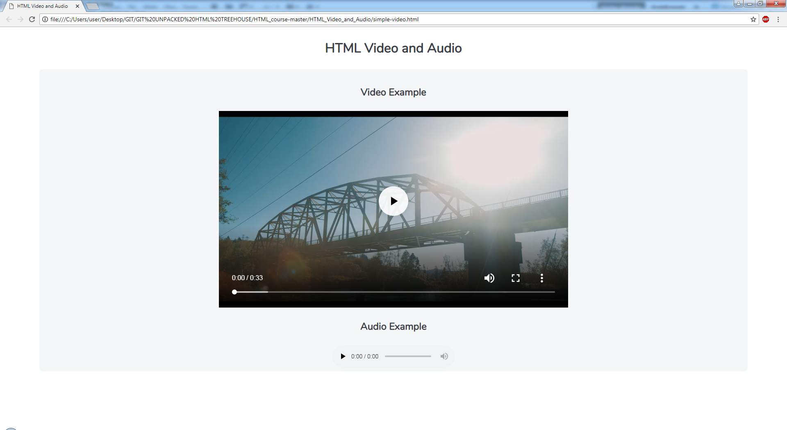  

- - -
**19. Create a Media Player with MediaElements.js** :heavy_check_mark:
* MediaElement.js basics
- - -
**20. AJAX Basics** :heavy_check_mark:
* AJAX Concepts
* How to use JavaScript to make AJAX requests
* How to use jQuery to make AJAX requests
* How to process JSON with jQuery and JavaScript
* How to use a 3rd party API with AJAX and jQuery
- - -
**21. Object-Oriented JavaScript** :heavy_check_mark:
* Basics of object-oriented programming
* Creating your own objects with properties and methods
* ES2015 Class syntax
* Constructors, getters, and setters
- - -
**22. Web Accessibility Compliance** :heavy_check_mark:
* Accessibility at a Glance
* NonVisual Desktop Access
* WCAG 2.0
* Semantic HTML
* WAI-ARIA
* Testing for Accessibility
- - -
**23. Website Optimization** :heavy_check_mark:
* Overview of the Chrome DevTools
* Website optimization using the Chrome DevTools
* Code debugging with the Chrome DevTools
- - -
**24. Hosting Your Websites** :heavy_check_mark:
* GitHub Pages

